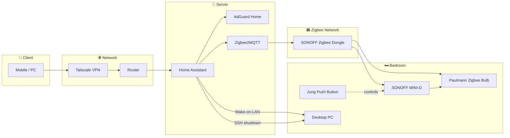

<!-- HERO SECTION -->

  

  

    

  
  

  <h3>Building a private, self-hosted, and locally controlled smart home.</h3>

  

 

<!-- TECH STACK -->

  
<strong>CURRENT INFRASTRUCTURE</strong>

  

    

  
  
  

 

<!-- TABLE OF CONTENTS -->

**[📊 Current Status](#current-status) · [🧩 Stack](#stack) · [🖧 System Topology](#system-topology) · [💡 Devices](#devices) · [🤖 Automations](#automations) · [🧭 Architecture Decisions](#architecture-decisions) · [🗺️ Roadmap](#roadmap) · [💰 Project Investment](#project-investment)**

 
 

# 📊 Current Status

> Building a solid foundation: infrastructure first, devices second.

| Area | Status | Progress |
|:---:|:---:|:---:|
| 🧠 Core Services | Operational |  |
| 📻 Zigbee Network | Expanding |  |
| 🤖 Automations | Early Development |  |

### Currently running

- 🧠 Home Assistant as the central automation platform.

- 🌍 Secure remote access via Tailscale VPN.

- 🛡️ DNS-level network filtering with AdGuard Home.

- 💡 First Zigbee-enabled smart room.

### Recent updates

- **Sept 2026** — Repository initialized; secrets externalized from `configuration.yaml`.

 
 

# 🧩 Stack

> Each layer chosen for a reason, not just because it's popular right now.

| Layer | Technology | Purpose |
|:---|:---|:---|
| Hardware | Raspberry Pi 4 (8 GB) + 240 GB SSD, USB boot | Headless home server; SSD avoids microSD wear and I/O bottlenecks |
| Zigbee coordinator | SONOFF Zigbee 3.0 USB Dongle | Own coordinator hardware, no dependency on a closed integration |
| Automation engine | Home Assistant Core | Central automation and state engine |
| Device network | Zigbee2MQTT + Mosquitto | Decouples the Zigbee stack from HA core via MQTT |
| DNS / filtering | AdGuard Home | Network-wide filtering for every device on the LAN |
| Remote access | Tailscale (WireGuard mesh) | Remote access without exposing ports to the internet |
| Configuration management | Git + GitHub, VS Code Remote-SSH | Version-controlled configuration, edited directly on the host |
| Secrets management | `secrets.yaml` / `secrets.yaml.example` | Credentials kept out of version control, validated with `ha core check` |
| Persistence | Recorder (SQLite) | State history with a bounded retention policy |

 
 

# 🖧 System Topology

> Current architecture of the smart home infrastructure.

 
 

# 💡 Devices

> What's actually deployed and controlled today.

| Device | Location | Protocol | Function |
|:---|:---|:---|:---|
| Paulmann 50127 Zigbee Bulb | Bedroom table lamp | Zigbee | On/off, RGBW color control |
| SONOFF MINI-D relay | Bedroom ceiling light | Zigbee | Switched via a Jung double push button |
| Desktop PC | Bedroom | Wake-on-LAN + SSH | Remote power on/off; remote desktop control via RustDesk |

 
 

# 🤖 Automations

> Two automations running today.

### Table lamp — solar elevation trigger

- **Trigger:** sun elevation drops below 3°, and the Desktop PC is powered on.

- **Action:** turns on the bedroom table lamp with a smooth brightness transition.

### Double push button — light and color control

- **Trigger:** single press on the Jung double push button.

- **Action:** toggles the bedroom ceiling light on/off.

- **Trigger:** quick double press.

- **Action:** cycles the table lamp's color.

 
 

# 🧭 Architecture Decisions

> Short-form record of the trade-offs behind this setup — not just what was built, but why. Full write-ups live in [`docs/adr/`](docs/adr).

| ID | Title | Status |
|:---|:---|:---:|
| [0001](docs/adr/0001-tailscale-over-port-forwarding.md) | Tailscale over port forwarding | Accepted |
| [0002](docs/adr/0002-zigbee-over-wifi-and-matter.md) | Zigbee over Wi-Fi (and Matter) for device connectivity | Accepted |
| [0003](docs/adr/0003-zigbee2mqtt-over-zha.md) | Zigbee2MQTT over Home Assistant's native ZHA integration | Accepted |
| [0004](docs/adr/0004-vscode-remote-ssh-over-code-server.md) | VS Code Remote-SSH over code-server | Accepted |

 
 

# 🗺️ Roadmap

> Prioritized by impact vs. effort.

- [ ] Split `configuration.yaml` into domain-specific files
- [ ] Harden the SSH shutdown command (fixed `known_hosts` + restricted `authorized_keys`)
- [ ] Assign areas and rename entities
- [ ] Reusable blueprint for the double push button
- [ ] Dashboard with Mushroom Cards (HACS)
- [ ] Automated backups
- [ ] pre-commit + detect-secrets
- [ ] GitHub Actions (yamllint)

 
 

# 💰 Project Investment

> Hardware purchased to build the smart home infrastructure.

| Date | Component | Purpose | Cost |
|:---|:---|:---|---:|
| March 2026 | Raspberry Pi 4 (8 GB) | Home Assistant server | €30.00 |
| March 2026 | 5V 3A Power Supply | Raspberry Pi power supply | €9.99 |
| March 2026 | **SanDisk 240 GB SSD** *(reused)* | System storage | €0.00 |
| April 2026 | **SONOFF Zigbee 3.0 USB Dongle** | Zigbee network coordinator | €25.13 |
| April 2026 | USB Extension Cable *(reused)* | Dongle positioning | €0.00 |
| April 2026 | **UGREEN USB-to-SATA Adapter** | SSD connection | €11.89 |
| April 2026 | **Paulmann 50127 Zigbee Bulb** | First smart lighting device | €11.99 |
| May 2026 | **SONOFF MINI-D** | Smart switch relay | €18.20 |
| June 2026 | **Jung LS** Single Frame (Matte White) | Switch finish | €9.92 |
| June 2026 | **Jung LS** Double Rocker (Matte White) | Double push button | €14.99 |
| June 2026 | **Jung 535U** Push Button Mechanism | Momentary switch mechanism | €13.33 |
| July 2026 | Aluminum Raspberry Pi Case | Passive cooling | €13.99 |

---

## 📊 Summary

| Category | Total |
|:---|---:|
| 🖥️ Infrastructure | **€65.87** |
| 📻 Zigbee Network | **€25.13** |
| 💡 Smart Lighting | **€11.99** |
| 🔘 Smart Switching | **€56.44** |
| **💰 Total Investment** | **€159.43** |

> **Note:** Some components were reused from previous hardware and therefore do not contribute to the total project cost.