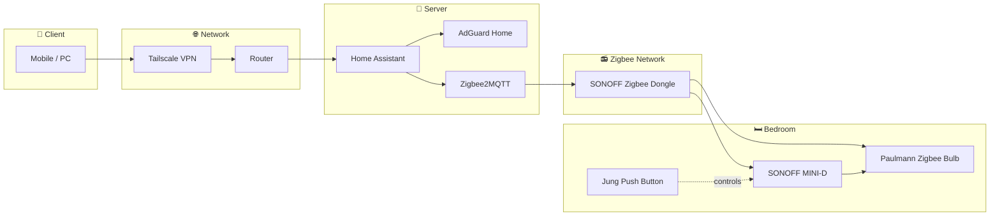

<!-- HERO SECTION -->

  
  

    

  
  

  <h3>Building a private, self-hosted, and locally controlled smart home.</h3>
  

 

<!-- TECH STACK -->

  
<strong>CURRENT INFRASTRUCTURE</strong>

  

    

  
  
  

 
 

# 📊 Current Status

> Building a solid foundation: infrastructure first, devices second.

| Area | Status | Progress |
|:---:|:---:|:---:|
| 🧠 Core Services | Operational |  |
| 📻 Zigbee Network | Expanding |  |
| 🤖 Automations | Early Development |  |

### Currently running

- 🧠 Home Assistant as the central automation platform.
- 🌍 Secure remote access via Tailscale VPN.
- 🛡️ DNS-level network filtering with AdGuard Home.
- 💡 First Zigbee-enabled smart room.

 
 

# 🖧 System Topology

> Current architecture of the smart home infrastructure.

 
 

# 💰 Project Investment

> Hardware purchased to build the smart home infrastructure.

| Date | Component | Purpose | Cost |
|:---|:---|:---|---:|
| March 2026 | Raspberry Pi 4 (8 GB) | Home Assistant server | €30.00 |
| March 2026 | 5V 3A Power Supply | Raspberry Pi power supply | €9.99 |
| March 2026 | **SanDisk 240 GB SSD** *(reused)* | System storage | €0.00 |
| April 2026 | **SONOFF Zigbee 3.0 USB Dongle** | Zigbee network coordinator | €25.13 |
| April 2026 | USB Extension Cable *(reused)* | Dongle positioning | €0.00 |
| April 2026 | **UGREEN USB-to-SATA Adapter** | SSD connection | €11.89 |
| April 2026 | **Paulmann 50127 Zigbee Bulb** | First smart lighting device | €11.99 |
| May 2026 | **SONOFF MINI-D** | Smart switch relay | €18.20 |
| June 2026 | **Jung LS** Single Frame (Matte White) | Switch finish | €9.92 |
| June 2026 | **Jung LS** Double Rocker (Matte White) | Double push button | €14.99 |
| June 2026 | **Jung 535U** Push Button Mechanism | Momentary switch mechanism | €13.33 |
| July 2026 | Aluminum Raspberry Pi Case | Passive cooling | €13.99 |

---

## 📊 Summary

| Category | Total |
|:---|---:|
| 🖥️ Infrastructure | **€65.87** |
| 📻 Zigbee Network | **€25.13** |
| 💡 Smart Lighting | **€11.99** |
| 🔘 Smart Switching | **€56.44** |
| **💰 Total Investment** | **€159.43** |

> **Note:** Some components were reused from previous hardware and therefore do not contribute to the total project cost.
